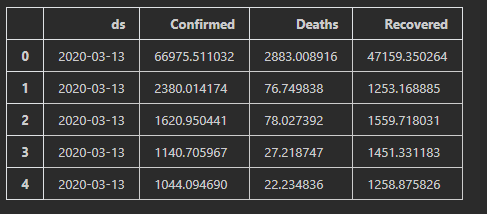

# Содержание

Новый коронавирус 2019 года (2019-nCoV) — это вирус (точнее, коронавирус), идентифицированный как причина вспышки
респираторного заболевания, впервые обнаруженного в Ухане, Китай. Ранее сообщалось, что многие из пациентов во время
вспышки в Ухане, Китай, имели некоторую связь с крупным рынком морепродуктов и животных, что свидетельствует о передаче
вируса от животного к человеку. Однако, как сообщается, все большее число пациентов не контактировали с рынками
животных, что указывает на то, что происходит передача вируса от человека к человеку. В настоящее время неясно,
насколько легко и устойчиво этот вирус распространяется между людьми – CDC

Этот набор данных содержит ежедневную информацию о количестве заболевших, смертей и выздоровлениях от нового
коронавируса 2019 года.

Нашей целью является прогнозирование количества зараженных/выздоровевших/умерших от covid-19. 

# [Ссылка на датасет](https://www.kaggle.com/datasets/sudalairajkumar/novel-corona-virus-2019-dataset)

# Опиание столбцов

- Sno - серийный номер
- ObservationDate - дата обследования в формате MM/DD/YYYY
- Province/State - Провинция или штат наблюдения
- Country/Region - Страна наблюдения
- Last Update - Время в формате UTC, когда обновляется строка для данной провинции или страны
- Confirmed - Совокупное количество подтвержденных случаев на эту дату
- Deaths - Совокупное количество смертей на эту дату
- Recovered - Совокупное количество выздоровевших на эту дату

# Вывод

Обучив модель основанную на дате обследования, городе и стране с помощью различных бустеров мы достигли слудующих результатов:

# Видео

https://drive.google.com/drive/folders/19N9ygh5Dxhuq4QVOVs-6NMf7gwPm40cY?usp=share_link

# Подготовили
- 11-009 Садоров Тимур
- 11-009 Нуруллин Ильдар
